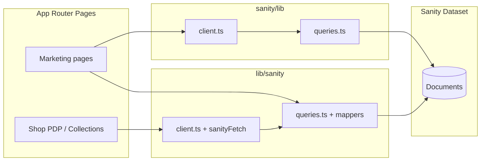

# V Design — Project Blueprint (Architectural Audit)

> **Generated:** 2026-05-25  
> **Purpose:** Single source of truth for routing, components, Sanity CMS, and gaps before new feature work.  
> **Stack (actual):** Next.js 16 App Router · React 19 · Sanity v5 · Razorpay checkout · Tailwind 4 — *not* the Shopify stack described in older `PROJECT_MASTER_GUIDE.md`.

---

## 1. Executive Summary

| Area | Status |
|------|--------|
| **Marketing routes** | Mostly built; mix of CMS-backed and static JSX heroes |
| **Commerce routes** | CMS-backed via `src/lib/sanity/*` (collections, PDP, cart API) |
| **Sanity registration** | Dual folders: `src/sanity/schemas/` (catalog + home) + `src/sanity/schemaTypes/` (agency/marketing docs) |
| **Query layer** | **Split:** `src/sanity/lib/queries.ts` (marketing) vs `src/lib/sanity/queries.ts` (catalog/home document) |
| **Critical cleanup** | Orphan block components, unused `industry` schema, duplicate query clients, CMS fields not wired on Contact hero |

---

## 2. Repository Topology (`src/`)

```
src/
├── app/                    # Next.js App Router (all public URLs)
├── components/
│   ├── blocks/             # Page sections (marketing + shop UI)
│   ├── catalog/            # Collection/product grids, search modal
│   ├── forms/              # Consultation form
│   ├── layout/             # AppChrome, Header, Footer, shells, cart
│   ├── motion/             # FadeIn (unused)
│   ├── product/            # PDP panels, variants, MOQ
│   ├── providers/          # Cart, Lenis smooth scroll
│   └── ui/                 # Button, scroll-to-top
├── hooks/                  # use-cart
├── lib/
│   ├── sanity/             # Catalog client, mappers, GROQ (shop)
│   ├── data/               # home, catalog, shop, product resolvers
│   ├── contact/            # Contact fallbacks
│   ├── razorpay/           # Payment
│   ├── checkout/           # Totals, order notes
│   └── commerce/           # MOQ, pricing
├── sanity/
│   ├── env.ts
│   ├── schemaTypes/        # Marketing document types + index aggregator
│   ├── schemas/            # Catalog/home object types
│   ├── lib/client.ts       # Marketing Sanity client
│   └── lib/queries.ts      # Marketing GROQ
├── styles/globals.css
└── types/                  # cart, checkout, home, sanity, contact, resources, service
```

**Sanity Studio:** `/studio` → `sanity.config.ts` imports `schema` from `src/sanity/schemaTypes/index.ts`.

---

## 3. Routing Architecture

Route groups `(agency)` and `(shop)` **do not** appear in URLs; they only add layout wrappers (`AgencyShell` / `ShopShell` = `pt-16` padding).

All routes use the **root** `layout.tsx` → `AppChrome` (global `Header`, `SmoothScroll`, `CartDrawer`) + `Footer`.

### 3.1 Route tree

```
/ ............................................... Home
├── /about ...................................... About Us
├── /services ................................... Services listing
├── /products ................................... Products (marketing categories — not catalog)
├── /shop ....................................... Shop catalog (filters sidebar)
├── /portfolio .................................. Portfolio grid
├── /industries ................................. Industries
├── /resources .................................. Resources hub
├── /contact .................................... Contact + form
├── /consultation ............................... Consultation (form → /api/contact)
├── /atelier .................................... Studio stub
├── /collections ................................ Collections index (root, not in (shop) group)
├── /collections/[slug] ......................... Collection PLP ((shop) group)
├── /products/[handle] .......................... Product PDP ((shop) group)
├── /work ....................................... Agency work stub ((agency) group)
└── /studio/[[...tool]] ......................... Sanity Studio (separate studio layout)

/api/checkout ................................. Razorpay order creation
/api/contact .................................. Consultation email handler
/api/message .................................. Contact page form handler
/api/search ................................... Product search
/api/ai/generate-description .................. AI helpers (admin)
/api/ai/generate-product-content .............. AI helpers (admin)
```

### 3.2 Route status matrix

| Route | Page file | Data source | CMS-connected? | Notes |
|-------|-----------|-------------|----------------|-------|
| `/` | `app/page.tsx` | `resolveHomePageContent()` + `sanity/lib` queries | **Partial** | Hero from `homePage` (`lib/sanity`); sections use separate queries; `ServicesSection` is **static**; `homePage.services` / `featuredCollections` / `aboutStudio` largely unused on page |
| `/about` | `app/about/page.tsx` | `ABOUT_PAGE_QUERY`, `FOUNDER_QUERY` | **Yes** | Full page CMS + founder |
| `/services` | `app/services/page.tsx` | `SERVICES_QUERY` (`service` documents) | **Partial** | Grid CMS; hero/copy **static JSX** |
| `/products` | `app/products/page.tsx` | None | **Static** | `ProductCategories` placeholders; not `product` catalog |
| `/shop` | `app/shop/page.tsx` | `ALL_PRODUCTS_QUERY`, `ALL_CATEGORIES_QUERY` | **Yes** | Catalog browse |
| `/portfolio` | `app/portfolio/page.tsx` | `ALL_PORTFOLIO_QUERY` | **Partial** | Grid CMS; header **static**; no `/portfolio/[slug]` |
| `/industries` | `app/industries/page.tsx` | None | **Static** | `industry` **schema exists, never queried** |
| `/resources` | `app/resources/page.tsx` | `RESOURCES_PAGE_QUERY`, posts, downloads | **Yes** | Hero uses CMS with fallbacks |
| `/contact` | `app/contact/page.tsx` | `CONTACT_PAGE_QUERY` | **Partial** | Info cards, map, offices CMS; hero **static**; `heading`/`subheading` in schema **not used** in UI |
| `/consultation` | `app/consultation/page.tsx` | Static + `/api/contact` | **Static** | Sidebar block only |
| `/collections` | `app/collections/page.tsx` | `getCollectionsForIndex()` (`lib/sanity`) | **Yes** | Custom cards (not `CollectionGrid` component) |
| `/collections/[slug]` | `app/(shop)/collections/[slug]/page.tsx` | `lib/sanity` | **Yes** | `ProductGrid` |
| `/products/[handle]` | `app/(shop)/products/[handle]/page.tsx` | `lib/sanity` | **Yes** | Full PDP + Razorpay path |
| `/work` | `app/(agency)/work/page.tsx` | None | **Static stub** | Linked from home CTA `/work` |
| `/atelier` | `app/atelier/page.tsx` | None | **Static stub** | Linked from home `ServicesSection` |
| `/studio` | `app/studio/[[...tool]]/page.tsx` | N/A | N/A | Embedded Studio |

### 3.3 Navigation vs routes

`Header` nav (`src/components/layout/header.tsx`): Home, Services, Products, Shop, Portfolio, Industries, Resources, About Us.

**Not in nav:** `/contact`, `/consultation`, `/collections`, `/work`, `/atelier`.

---

## 4. Layout & App Shell

| Piece | Role |
|-------|------|
| `app/layout.tsx` | Fonts, `globals.css`, `AppChrome`, `Footer`, `Toaster` (Sonner) |
| `app-chrome.tsx` | `Header` **outside** `SmoothScroll`; cart provider; no `grow` on `<main>` (footer flush) |
| `(shop)/layout.tsx` | `ShopShell` — extra top padding only |
| `(agency)/layout.tsx` | `AgencyShell` — extra top padding only |
| `studio/layout.tsx` | Studio-isolated layout |

---

## 5. Component Audit (`src/components`)

### 5.1 Actively used core blocks (imported by `app/**/page.tsx` or home)

| Component | Used on |
|-----------|---------|
| `hero-block` | `/` |
| `trust-strip`, `services-section`, `product-showcase`, `portfolio-showcase` | `/` |
| `why-choose-us`, `industry-solutions`, `creative-process` | `/`, `/industries` |
| `founder-story` | `/`, `/about` |
| `insights-section`, `premium-cta` | `/`, most marketing pages |
| `about-hero-heading`, `about-journey`, `about-studio`, `about-values` | `/about` |
| `services-grid`, `trust-badges` | `/services` |
| `product-categories`, `products-cta` | `/products` |
| `shop-catalog-section`, `shop-trust-banner`, `ecommerce-grid`, `shop-sidebar` | `/shop` |
| `portfolio-grid` | `/portfolio` |
| `industries-grid` | `/industries` |
| `resources-*` (articles, categories, downloads, search) | `/resources` |
| `contact-info-cards`, `contact-layout` | `/contact` |
| `consultation-sidebar` + `forms/consultation-form` | `/consultation` |
| `section-divider` | Internal section spacing (many blocks) |

### 5.2 Catalog & product (commerce)

| Component | Used on |
|-----------|---------|
| `catalog/product-grid` | `/collections/[slug]` |
| `catalog/similar-products` | PDP |
| `catalog/product-search-modal` | `Header` |
| `product/*` (gallery, purchase panel, variants, MOQ, specs) | PDP |

`catalog/collection-grid.tsx` and `catalog/index.ts` export `CollectionGrid` — **not imported by any page** (collections index uses inline markup).

### 5.3 Orphaned / legacy / duplicate — safe deletion candidates

> **Do not delete until confirmed no dynamic imports.** Grep showed no page imports for these.

| File | Reason |
|------|--------|
| `blocks/about-studio-section.tsx` | Superseded by `about-studio.tsx` (used on `/about`) |
| `blocks/featured-collections-grid.tsx` | No imports; home does not use `homePage.featuredCollections` in UI |
| `blocks/signature-pieces-grid.tsx` | No imports; home uses `product-showcase` + ad-hoc query instead |
| `blocks/service-story-grid.tsx` | No imports; replaced by `services-section` (static) + `/services` grid |
| `blocks/product-purchase-panel.tsx` | Re-export shim only; PDP uses `@/components/product/product-purchase-panel` |
| `blocks/index.ts` barrel | Exports orphans only; **no consumer** imports `@/components/blocks` |
| `motion/FadeIn.tsx` | Exported from `motion/index.ts` only; never used |
| `layout/navbar.tsx` | Deprecated alias → `Header`; only re-exported from `layout/index.ts` |

### 5.4 Previously removed (confirm absent)

- `blocks/contact-form.tsx` — replaced by `contact-layout.tsx`
- `blocks/contact-details.tsx` — replaced by `contact-info-cards.tsx` + `contact-layout.tsx`
- `sanity/schemas/objects/service.ts` — **removed** (collision with `service` document); replaced by `serviceCard.ts`

### 5.5 Partially wired CMS UI (not orphan, but incomplete)

| Component | Issue |
|-----------|--------|
| `services-section.tsx` | Fully static; ignores `homePage.services` (`serviceCard`) from Sanity |
| `contact` page hero | Ignores `contactPage.heading` / `subheading` from CMS |
| `services` page hero | Static; no `servicesPage` singleton schema |

---

## 6. Sanity CMS Audit

### 6.1 Registration flow

```
sanity.config.ts
  └── schema.types ← src/sanity/schemaTypes/index.ts
        ├── ...schemaTypes  ← src/sanity/schemas/index.ts  (11 types)
        └── + 10 marketing documents from schemaTypes/*.ts
```

**Total registered types: 21** (no duplicate `name` values after `service` → `serviceCard` rename).

### 6.2 `src/sanity/schemas/` — catalog & home (1:1 with `schemas/index.ts`)

| File | Schema `name` | In `index.ts`? |
|------|---------------|----------------|
| `documents/homePage.ts` | `homePage` | Yes |
| `documents/siteSettings.ts` | `siteSettings` | Yes |
| `documents/collection.ts` | `collection` | Yes |
| `documents/product.ts` | `product` | Yes |
| `documents/productSize.ts` | `productSize` | Yes |
| `documents/productFrame.ts` | `productFrame` | Yes |
| `objects/heroBlock.ts` | `heroBlock` | Yes |
| `objects/serviceCard.ts` | `serviceCard` | Yes |
| `objects/cta.ts` | `cta` | Yes |
| `objects/productGalleryImage.ts` | `productGalleryImage` | Yes |
| `objects/productVariant.ts` | `productVariant` | Yes |

**1:1 compliance:** 11 files ↔ 11 exports in `schemas/index.ts`. No extra schema files in this folder.

### 6.3 `src/sanity/schemaTypes/` — marketing documents

| File | Schema `name` | In `schemaTypes/index.ts`? |
|------|---------------|----------------------------|
| `aboutPage.ts` | `aboutPage` | Yes |
| `category.ts` | `category` | Yes |
| `contactPage.ts` | `contactPage` | Yes |
| `downloadResource.ts` | `downloadResource` | Yes |
| `founder.ts` | `founder` | Yes |
| `industry.ts` | `industry` | Yes |
| `portfolio.ts` | `portfolio` | Yes |
| `post.ts` | `post` | Yes |
| `resourcesPage.ts` | `resourcesPage` | Yes |
| `service.ts` | `service` | Yes |
| `product.ts` | *(re-export only)* | **No — not registered here** |
| `index.ts` | — | Aggregator |

**1:1 compliance:** 10 definition files are registered; `product.ts` is a **documentation re-export** pointing to `schemas/documents/product.ts` (already registered via `...schemaTypes`). Safe to keep as comment-only or delete file if team prefers one path.

### 6.4 Naming collisions (resolved)

| Historical issue | Resolution |
|------------------|------------|
| `service` object (homepage array) vs `service` document | Object renamed to **`serviceCard`**; document remains **`service`** |

**Action:** If legacy Sanity documents still have `_type: "service"` inside `homePage.services[]`, migrate to `serviceCard` in the dataset.

### 6.5 Unused schema (registered, no GROQ / page)

| Schema | Status |
|--------|--------|
| `industry` | Registered in Studio; **`/industries` uses hardcoded grid** — no query |

### 6.6 Schema ↔ GROQ cross-check (`src/sanity/lib/queries.ts`)

| Query | `_type` | Schema fields used | Valid? |
|-------|---------|-------------------|--------|
| `ALL_PRODUCTS_QUERY` | `product` | title, slug, price, rating, reviewsCount, isBestSeller, image, category | OK (catalog fields on product doc) |
| `ALL_CATEGORIES_QUERY` | `category` | title, slug | OK |
| `ALL_PORTFOLIO_QUERY` | `portfolio` | title, slug, category→title, client, description, image | OK |
| `HOME_FEATURED_PRODUCTS_QUERY` | `product` | subset | OK |
| `HOME_RECENT_PORTFOLIO_QUERY` | `portfolio` | subset | OK |
| `ABOUT_PAGE_QUERY` | `aboutPage` | hero, journey, values, studio fields | OK |
| `FOUNDER_QUERY` | `founder` | name, role, heading, quote, bio, image, signature | OK |
| `LATEST_POSTS_QUERY` | `post` | title, slug, publishedAt, excerpt, image, category | OK — **no `body` on schema** (detail pages N/A) |
| `RESOURCES_PAGE_QUERY` | `resourcesPage` | hero fields | OK |
| `RESOURCES_POSTS_QUERY` | `post` | same as latest | OK |
| `DOWNLOADS_QUERY` | `downloadResource` | title, subtitle, file, previewImage | OK |
| `SERVICES_QUERY` | `service` | title, slug, shortDescription, coverImage | OK |
| `CONTACT_PAGE_QUERY` | `contactPage` | heading, subheading, contact fields, offices | OK — **heading/subheading unused in React** |

### 6.7 Catalog GROQ (`src/lib/sanity/queries.ts`)

| Query / helper | `_type` | Notes |
|----------------|---------|-------|
| `HOME_PAGE_WITH_CATALOG_QUERY` | `homePage` | Filters `_id == "homePageV2"` for editorial slice |
| `HOME_PAGE_QUERY` | `homePage` | Legacy/simpler home fetch |
| Collection/product/siteSettings queries | `collection`, `product`, `siteSettings` | PDP, PLP, settings — **primary commerce layer** |

**Duplication risk:** Two clients (`src/sanity/lib/client.ts` vs `src/lib/sanity/client.ts`) and two query modules. Consolidation recommended before scaling.

### 6.8 Studio structure

`src/sanity/structure.ts` — default flat `documentTypeListItems()` (no custom desk grouping).

---

## 7. API & Data Flow



- **Home:** `resolveHomePageContent()` → `lib/sanity` + parallel `sanity/lib` queries for products/portfolio/posts/founder.
- **Checkout:** `/api/checkout` + Razorpay (`src/lib/razorpay/*`).
- **Forms:** Contact → `/api/message`; Consultation → `/api/contact`.

---

## 8. Missing Pieces & Roadmap

### 8.1 Pages missing or stub-only

| Item | Priority |
|------|----------|
| `/portfolio/[slug]` — case study detail | High |
| `/resources/[slug]` or `/insights/[slug]` — blog post body (needs `body` / Portable Text on `post`) | High |
| `/services/[slug]` — service detail | Medium |
| `/work` — agency case studies (or merge with portfolio) | Medium |
| `/atelier` — studio story (or redirect to `/about`) | Low |
| `/contact` in main nav | UX |
| Legal: `/privacy`, `/terms` | Medium |
| `servicesPage`, `industriesPage`, `portfolioPage` singletons for editable heroes | Medium |

### 8.2 Schemas missing (recommended)

| Schema | Purpose |
|--------|---------|
| `servicesPage` | Hero + SEO for `/services` |
| `industriesPage` | Hero + intro for `/industries` |
| `portfolioPage` | Hero for `/portfolio` |
| `productsPage` | Marketing `/products` copy (optional) |
| `post.body` | Rich text for article detail |
| `portfolio` detail fields | Long case study, video, credits (optional) |

### 8.3 CMS wiring gaps (existing schemas, underused)

| Gap | Fix |
|-----|-----|
| `industry` documents | Wire `INDUSTRIES_QUERY` → `industries-grid.tsx` |
| `homePage.services` (`serviceCard`) | Feed `services-section` or remove field |
| `homePage.featuredCollections` / `featuredProducts` | Use mapped data vs duplicate `HOME_*` queries |
| `contactPage.heading` / `subheading` | Bind to contact hero |
| Home `aboutStudio` | Render on `/` or remove from schema |

### 8.4 Architecture consolidation (non-feature)

1. Merge `sanity/lib` and `lib/sanity` into one module with tagged exports.
2. Delete orphan blocks listed in §5.3.
3. Align docs: update or archive `PROJECT_MASTER_GUIDE.md` (Shopify references are obsolete).
4. Single Sanity document id strategy for `homePage` vs hardcoded `homePageV2` filter.

---

## 9. Critical Warnings (Immediate Action)

| Severity | Issue | Action |
|----------|-------|--------|
| **High** | Orphan `service.ts` object file was deleted; verify dataset has no stale `_type: "service"` in `homePage.services[]` | Run Studio validation / GROQ audit |
| **High** | `industry` schema registered but unused — editorial confusion | Wire page or remove from schema index |
| **Medium** | 4 block components + `blocks/index.ts` barrel + `FadeIn` + `navbar` alias — dead code | Delete after final grep in CI |
| **Medium** | `blocks/product-purchase-panel.tsx` duplicate re-export | Delete; use `components/product` only |
| **Medium** | `contactPage.heading` / `subheading` fetched but not rendered | Wire UI or drop from query |
| **Medium** | Dual Sanity clients/queries | Plan consolidation |
| **Low** | `schemaTypes/product.ts` not in registry | Keep as doc pointer or remove file |
| **Low** | `CollectionGrid` unused | Delete or use on `/collections` |
| **Low** | `/work` linked from home but stub | Implement or change CTA href |

---

## 10. Reference: Active Sanity type registry (21)

**Documents:** `homePage`, `siteSettings`, `collection`, `product`, `productSize`, `productFrame`, `aboutPage`, `category`, `contactPage`, `downloadResource`, `founder`, `industry`, `portfolio`, `post`, `resourcesPage`, `service`

**Objects:** `heroBlock`, `serviceCard`, `cta`, `productGalleryImage`, `productVariant`, plus inline objects on `contactPage.offices` and `homePage.aboutStudio`

---

## 11. Related internal docs

| File | Relevance |
|------|-----------|
| `DESIGN_SYSTEM.md` | Visual tokens |
| `COMPONENT_RULES.md` | Block conventions |
| `CONTENT_GUIDE.md` | Editorial tone |
| `SHOPIFY_SETUP.md` | **Legacy** — commerce is Sanity + Razorpay |
| `PROJECT_MASTER_GUIDE.md` | **Partially outdated** — use this blueprint for routing/CMS truth |

---

*End of blueprint. Update this file when routes, schemas, or deletion cleanups land.*
